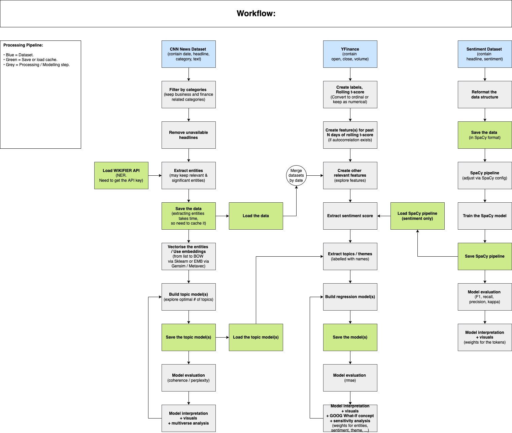

# __MADS M2 Estimating News Impact On The Financial Market__ 

## __Project Purpose__ 

Employees working in the financial sector are facing an immense amount of information everyday compared to other sectors. The industry grapples with an overwhelming amount of unstructured data, such as media articles, research reports, and company filings. Efficiency has become a need in today’s society as employers in the financial sector are fighting to get first-hand information and stay up-to-date with the current state of the world. Hence, we seek to close this gap by examining the extent to which financial news articles affect the volatility of the SPDR S&P 500 ETF (SPY). This is one of the largest ETF and a proxy for the 500 listed big-cap companies in the United States. This can be extended to include other media, regions, and markets, so as to determine the overall extent of media influence on the broader markets. Although this is our ultimate objective, we will only focus on smaller parts of the scope for this project such as the following: 

__Project goals / Motivation **:__

1.  Extract latent topic / theme: Extract latent topics to obtain the overall theme for each article. The topic model will be used to categorize news articles and output a feature (the topic or theme) for downstream regression tasks to estimate the SPY movement or volatility given the occurrence of that theme. 
1.  Extract news sentiment: Extract headline sentiment and the influence of specific tokens on the sentiment when interpreting the model. The outcome will be used as a feature to estimate the movement of SPY ETF or volatility. 
1.  Estimate the feature influence on SPY movement: We will use extracted themes / topics, sentiment, and other features to estimate their influence on SPY movement when interpreting the model. We are aware of the complexity behind the financial market research and consider this a smaller-scale project and a means to explore various tools related to NLP. We already expect a weak performance for the model. 

** Despite the goals mentioned above, our underlying intention is to explore various tools, concepts, good practices, and approaches related to ML and NLP we have learnt so far throughout the MADS program. We do not expect any spectacular insights from this project since this is about the financial market. However, we can leverage this framework to further extend our analysis scope and depth.

--- 

## __Folder Structure__

Folder Name | Description
--- | ---
source/config_py | Contain all the parameter configuration in python. 
source/config_spacy | Contain all the parameter configuration related to SpaCy pipeline. 
source/modules | Contain all the custom functions. 
source/notebooks | Contain all the steps for processing and modelling. 
sh | Contain all the CLI references for executing specific tasks. 
pipfile | For setting up the `pipenv` and tracking all the installed dependencies. 

---

## __Notebook Content__

Notebook Name | Description
--- | ---
build_topic_modelling | Framework and steps for building and analysing the topic model. 
build_spacy_sentiment | Framework and steps for building and analysing the sentiment model. 
build_mktmv_regression | Framework and steps for building and analysing the regression model. 
explore_embeddings | Framework and steps for building and analysing the embeddings. 

--- 

## __Guide On Initial Setup__

1.  Clone the repo to your directory and create a new branch. 

    ```
    git clone https://github.com/lioneltayyd/MADS-M2-estimating-news-impact-on-financial-market.git; 
    git checkout -b dev-name;
    cd MADS-M2-estimating-news-impact-on-financial-market/; 
    git add .; 
    git commit -m "Initiate a new branch."; 
    git push origin; 
    ```

1.  Ensure that you are using python 3.8.5 to avoid any code or dependencies 
    conflict due to version difference. 
    
    Options to download python: 

    -   https://www.python.org/downloads/
    -   https://docs.conda.io/en/latest/miniconda.html (python 3.8) 
    -   https://github.com/pyenv/pyenv#installation 

1.  Run this command to install `pipenv` package. You need to package to 
    install the python packages and dependencies. 

    ```bash
    pip install pipenv; 
    ```

    Ensure that `pipenv` is installed by running `pipenv --version`. 

1.  Next, run the following to activate the virtual environment. All your packages 
    will only made available within this environment. The `pipenv sync` is to ensure 
    that pipenv should match the exact version when installing the packages. 

    ```bash
    pipenv shell && pipenv sync; 
    ```

1.  Install `Jupyter` extension on your VSCode or alternative IDE to enable running 
    the notebook directly on your VSCode or IDE without installing `jupyter notebook`. 

1.  For VSCode users, press CMD + SHIFT + P and type `Reload Window` to reload the window after installing
    the python packages. Then press press CMD + SHIFT + P again and type `Select Interpreter` to 
    select the python interpreter `MADS-M2-estimating-news-impact-on-financial-market` 
    to run the notebook. 

--- 

## __Required Data Source Downloads__

1.  A new directory called `dataset` should be created within the main project directory.
2.  Download the datasets from [Google Drive](https://drive.google.com/drive/folders/1Scnd3fYHG_zd1wk6petvF-9U_QWosrLm?usp=sharing) and put them in the `dataset` directory. 

---

## __Processing Workflow & Workload Distribution Diagram__

This is our workflow guide. You can access `processing_flowchart.drawio` inside the `docs/flowchart` folder to view the diagrams. 

 
