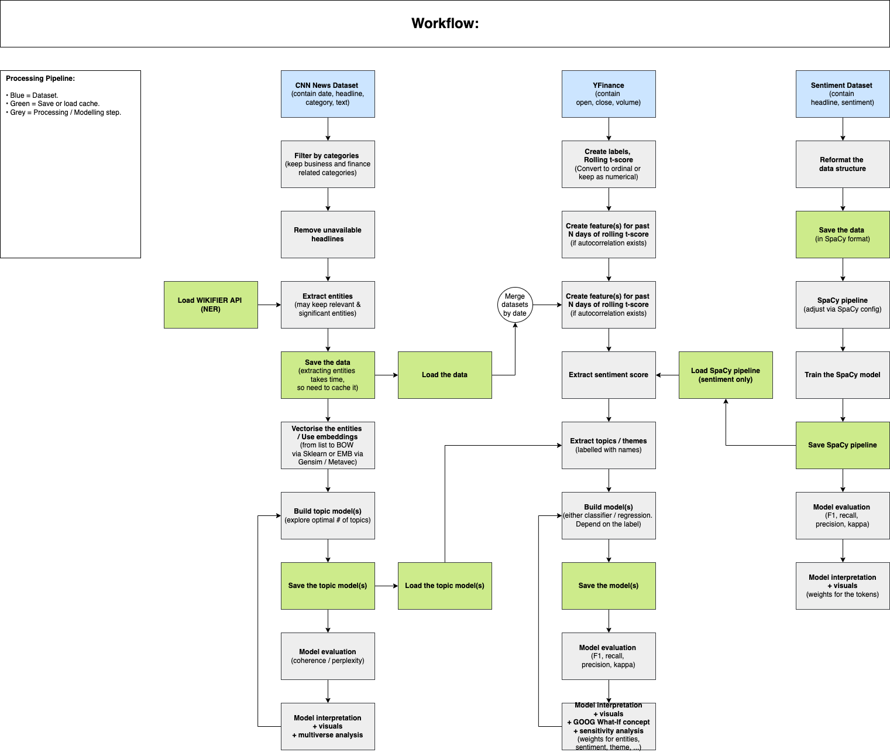
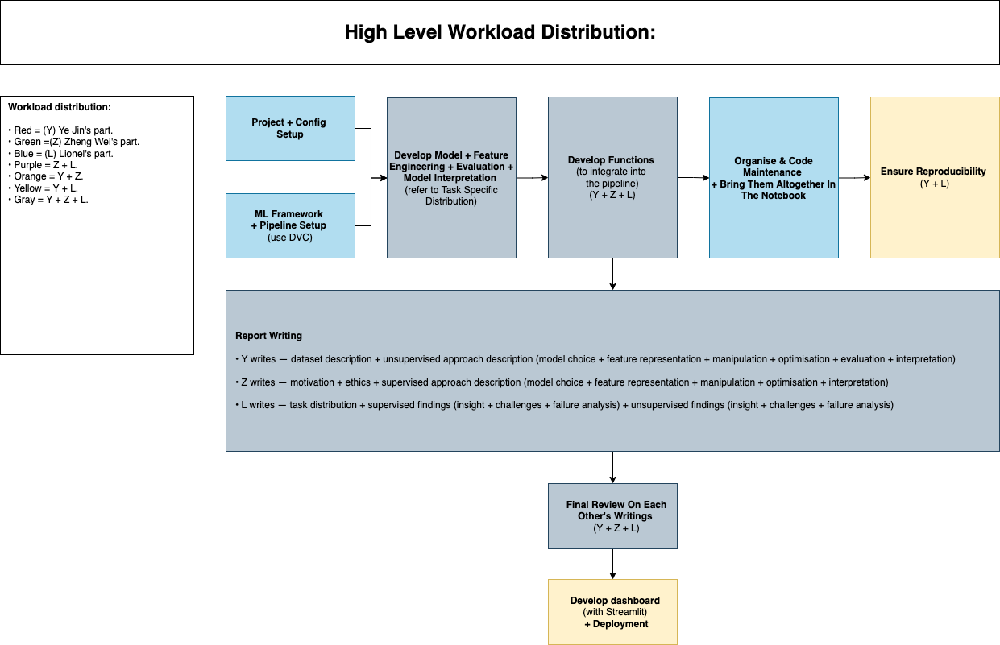

# __MADS M2 Estimating News Impact On The Financial Market__ 

## __Project Purpose__

Employees working in the financial sector are facing an immense amount of information everyday compared to other sectors. The industry grapples with an overwhelming amount of unstructured data, such as media, articles, research reports, and company filings. Efficiency has become a need in today’s society as employers in the financial sector are fighting to get first hand information and stay up-to-date with the current state of the world. Hence, we seek to close this gap by enhancing the reading experience for financial domain experts. Although this is our ultimate objective, we will only focus on smaller parts of the scope for this project such as the following. 

__Project goals:__

1. __Discover latent topic / theme:__ Discover latent topics to obtain the overall theme for each article. The model will be used to categorize the article and output a feature (the topic or theme) for the regression or classification task (either one) to estimate the market movement or volatility given the occurrence of that theme. For topic modeling, we have either direction to choose from (technical detail will explained later): 
Filter the articles by specific entities, say, commodities or other categories. Then discover the topics within that category. 
Discover the topics for the entire business and finance articles. We may have a larger set of topics for this. 
1. __Predict news sentiment:__ Discover sentiment for headlines and the influence of specific tokens on the sentiment when interpreting the model. The outcome will be used as a feature to estimate the market movement or volatility. 
1. __Estimate the feature influence on market movement:__ We will use extracted entities, themes, sentiment, or other features we discover along the way to estimate their influence on market movement when interpreting the model. The weight of the entities, themes, and sentiment will be used to inform readers the impact of the article on the overall financial market. We are aware of the complexity behind the financial market research, so this is just a tiny scope for exploration. 

--- 

## __Folder Structure__

Folder Name | Description
--- | ---
source/config_py | Contain all the parameter configuration in python. 
source/config_spacy | Contain all the parameter configuration related to SpaCy pipeline. 
source/modules | Contain all the custom functions. 
source/notebooks | Contain all the steps for processing and modelling. 
sh | Contain all the CLI references for executing specific tasks. 
pipfile | For setting up the `pipenv` and tracking all the installed dependencies. 

---

## __Notebook Content__

Notebook Name | Description
--- | ---
... | ...
... | ...

--- 

## __Guide On Initial Setup__

1.  Clone the repo to your directory and create a new branch. 

    ```
    git clone https://github.com/lioneltayyd/MADS-M2-estimating-news-impact-on-financial-market.git; 
    git checkout -b dev-name;
    cd MADS-M2-estimating-news-impact-on-financial-market/; 
    git add .; 
    git commit -m "Initiate a new branch."; 
    git push origin; 
    ```

1.  Ensure that you are using python 3.8.5 to avoid any code or dependencies 
    conflict due to version difference. 
    
    Options to download python: 

    -   https://www.python.org/downloads/
    -   https://docs.conda.io/en/latest/miniconda.html (python 3.8) 
    -   https://github.com/pyenv/pyenv#installation 

1.  Run this command to install `pipenv` package. You need to package to 
    install the python packages and dependencies. 

    ```bash
    pip install pipenv; 
    ```

    Ensure that `pipenv` is installed by running `pipenv --version`. 

1.  Next, run the following to activate the virtual environment. All your packages 
    will only made available within this environment. The `pipenv sync` is to ensure 
    that pipenv should match the exact version when installing the packages. 

    ```bash
    pipenv shell && pipenv sync; 
    ```

1.  Install `Jupyter` extension on your VSCode or alternative IDE to enable running 
    the notebook directly on your VSCode or IDE without installing `jupyter notebook`. 

1.  For VSCode users, press CMD + SHIFT + P and type `Reload Window` to reload the window after installing
    the python packages. Then repeat the previous step and type `Select Interpreter` to 
    select the python interpreter `MADS-M1-analysis-of-price-sensitivity-to-various-factors` 
    to run the notebook. 

--- 

## __Required Data Source Downloads__

1.  A new directory called `dataset` should be created within the main project directory.
2.  The following csv files should be downloaded from Kaggle and put in the `dataset` directory:

    - [CNN News Articles Ver2](https://www.kaggle.com/datasets/hadasu92/cnn-articles-after-basic-cleaning)
    - [Sentiment Dataset For Financial News](https://www.kaggle.com/datasets/ankurzing/sentiment-analysis-for-financial-news)

---

## __Processing Workflow & Workload Distribution Diagram__

You can access `processing_flowchart.html` inside the `docs/flowchart` folder to view the diagrams. 

 

 
